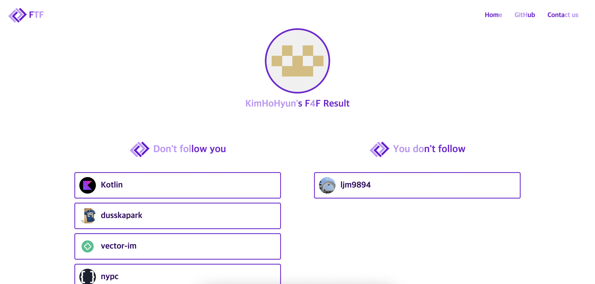

# FTF - Find the Followers

## Find the Followers
깃허브의 자신이 팔로잉 중인 사람과 팔로워를 알려주는 서비스입니다.  
자신이 맞팔로우하지 않는 사람, 자신을 맞팔로우하지 않는 사람을 찾아줍니다.  

## 기술스택

## Made By

<table>
    <tr>
        <td align="center">
            
        </td>
    </tr>
    <tr>
        <td align="center">박우빈</td>
    </tr>
</table>

